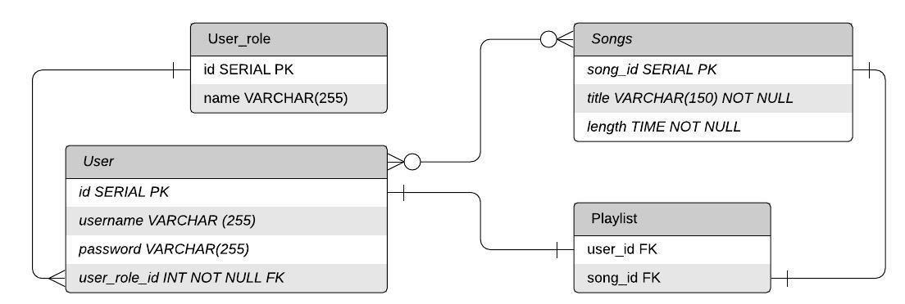

# SpotTunes
A Spotify Clone

# Team Members
Iqbal Anwar (@<a href = "https://github.com/iqbalanwar">iqbalanwar</a>) 
Christine Le (@<a href="https://github.com/le-christine">le-christine</a>) 
  
# Design Decisions
 
- Our SpotTunes app has four data models: `User`, `User_role`, `Song` and `Playlist`.
- The `User` has the fields id, username and password.
- The `Song` table has the fields id, title and length.
- The `User` and `User_role` are mapped to each other (one-to-many relationship)
- The `User` and `Song` tables are mapped to each other.
- The `Playlist` JOIN table connects user_id and song_id with a many-to-many relationship. 

- All of your design decisions.
- The reasons behind each decision.

# Completions
- What went right.

| Day            | 1                                    | 2                                            | 3                                                   | 4                                                     |5|
|----------------|--------------------------------------|----------------------------------------------|-----------------------------------------------------|-------------------------------------------------------|------|
| Goals  |Handled login/signup   Created User table |  Created Songs and  User Role tables | Create Playlist JOIN Table & map Attach roles to users Add Security   | Delete Song View Roles Debug Playlist Mapping Testing (add/delete song, signup/in| |
| Task Completed?  | Y  | Y  | Y | Y  | |

# Challenges
- Challenges you faced.
# Reflection 
- Which part you enjoyed working on the most.
