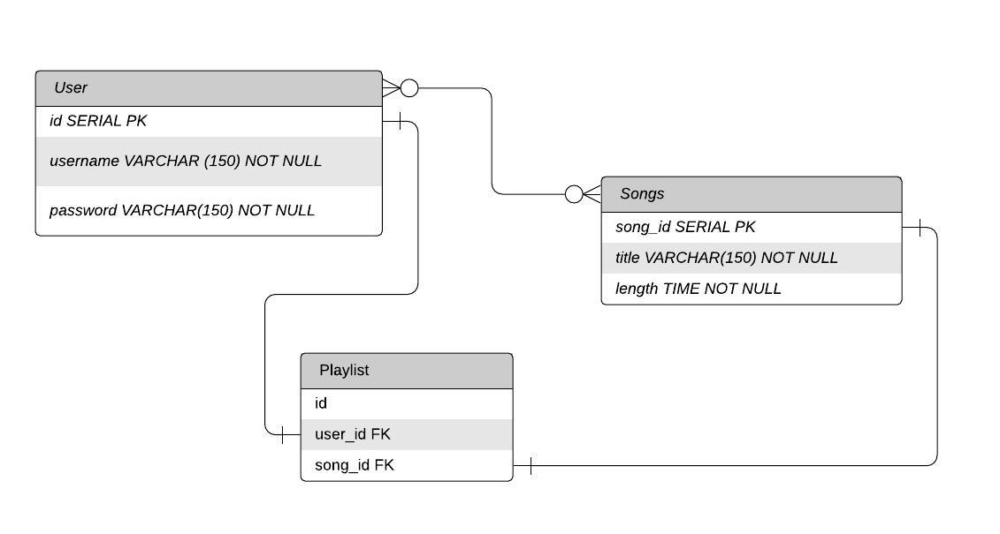

# SpotTunes
A Spotify Clone

# Team Members
Iqbal Anwar (@<a href = "https://github.com/iqbalanwar">iqbalanwar</a>) 
Christine Le (@<a href="https://github.com/le-christine">le-christine</a>) 
  
# Design Decisions
 
- Our SpotTunes app has three data models: `User`,`Song` and `Playlist`.
- The `User` has the fields id, username and password.
- The `Song` table has the fields id, title and length.
- The `User` and `Song` tables are mapped to each other.
- The `Playlist` JOIN table connects user_id and song_id with a many-to-many relationship. 

- All of your design decisions.
- The reasons behind each decision.

# Completions
- What went right.
# Challenges
- Challenges you faced.
# Reflection 
- Which part you enjoyed working on the most.

